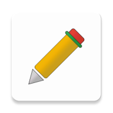

  

<h1 align="center">
  Multi Note Pad
</h1>

  A modern, lightweight note pad with a minimalist design.

   
  

## What is Multi Note Pad and why do I care?

I have been waiting long enough for a simplistic Android notepad app to come so I
decide to create one myself. Don’t get me wrong, Google Keep, Evernote, and OneNotes are great apps. 
I have used them and I will continue to use them in the future. However, they are either too heavy or more loaded with unecessary functionalities. 
I had a desire to replace a complex cloud based Notepad App with a simplistic app or like a regular notepad that was lightweight and looked impressive to get things done as
quickly as possible. Most importantly,
it had to be blazingly fast and simplistic to everyone. 

So here comes the “Multi Note Pad” 🎉.

* Material Design.
* Blazingly fast and lightweight.
* Dark Mode.
* Multi-line text support.
* Local Storage.
* No Ads, No Pop-ups.
* Time Stamping.
* Most Recently Modified Sort.
* Real-time character count.

******* 📣 Multi Note Pad App is still evolving. *******

## Status update / Downloads :

[[04-07-2020] Version 1.2](https://github.com/chiragkhandhar/Multi-Note-Pad/blob/master/APKS/Multi_Note_Pad_v1.2.apk)

Check Releases tab for previous versions.

## Platform limitations :

* This is an Android Application, Apologies iOS users (and Windows users).
* This app works great with Android Oreo (API 26) and above.
* The notes are locally stored, so once you uninstall / clear your app data, you will loose your valuable notes.
* Notepad does not support fancy input and file formats like voice or images. I will add the sketching functionality in the further updates.

## Disclaimer and Privacy statement:

To be 100% transparent:

* Multi Note Pad does not and will never collect user information in terms of user privacy.
* I will not track your IP. 
* I will not record your typings or read any of your files created in Multi Note Pad. 
* No typings or files will be sent to me or third parties. 

I might use analytics tools to collect basic usage data such as how many times the program has been downloaded.

Feel free to review the source code.

## Contributing:

* Multi Note Pad is free and open source, if you like my work, please consider:
   * Star this project on GitHub
   * Endorse me [here](https://www.linkedin.com/in/chirag-khandhar/)

## Stay tuned 📢

